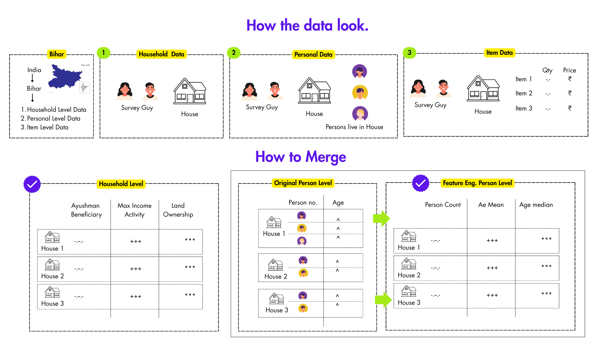
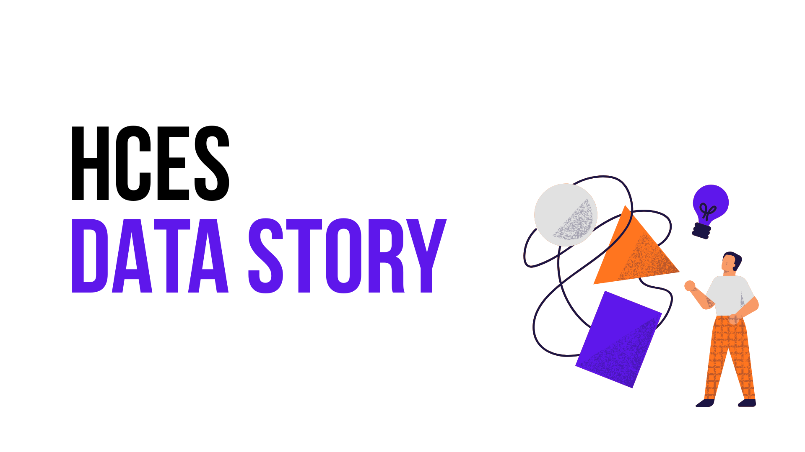
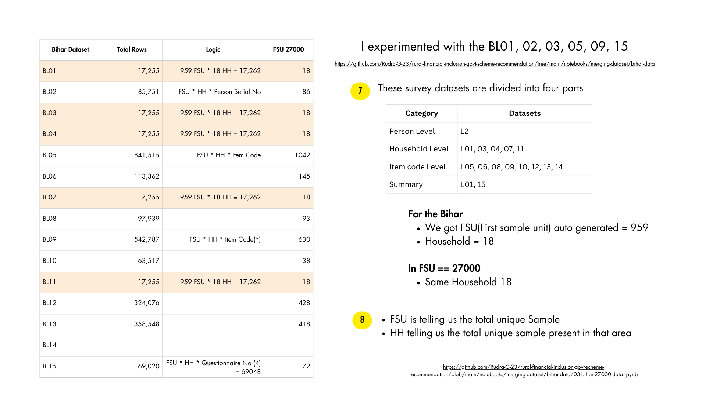
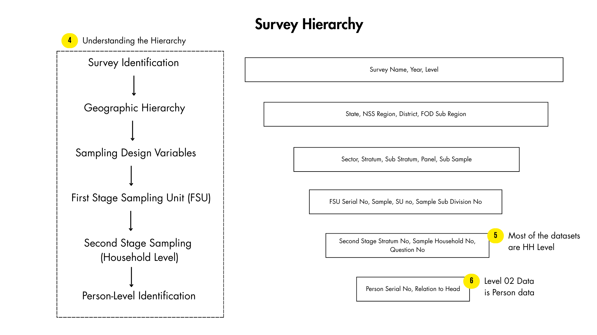
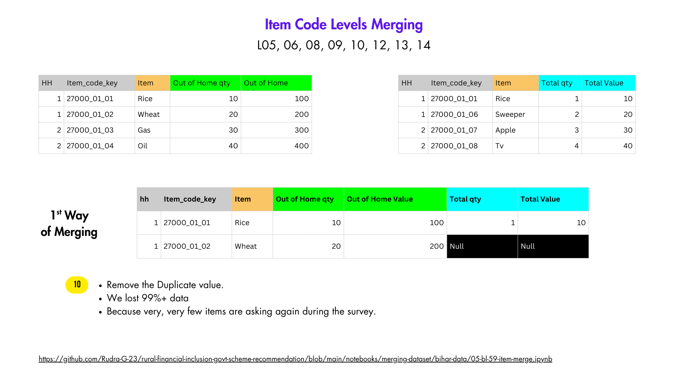

<div align="center">
  <h1>📊 Bihar In-Depth Analysis Dashboard</h1>
  <p>An interactive, data-driven web application to visualize and analyze the Bihar dataset.</p>

  

  <p>
    <strong>🔴 Live Link:</strong> <a href="https://bihar-visualize-dashboard-by-rudra.streamlit.app/">https://bihar-visualize-dashboard-by-rudra.streamlit.app/</a>
  </p>

  <p>
    <em>This is a sub-module of the main repository for All India Analysis:<br>
    <a href="https://github.com/Rudra-G-23/rural-financial-inclusion-govt-scheme-recommendation/tree/main">rural-financial-inclusion-govt-scheme-recommendation</a></em>
  </p>
</div>

---

## 📖 Overview

The **Bihar In-Depth Analysis Dashboard** provides comprehensive insights into Household Consumption Expenditure Survey (HCES) data for the state of Bihar. Built with **Streamlit** and powered by robust data manipulation libraries like **Polars** and **Pandas**, this application features dynamic visualizations created with **Plotly**. 

The dashboard enables users to explore complex datasets, understand merging strategies, and dive deep into item-level and household-level expenditures, aided by Principal Component Analysis (PCA) and feature selection techniques.

## 📜 Finding Preview

| HCES DATA STORY | Experiment Bihar Data |
| :---: | :---: |
|  |  |
| **Survey Hierarchy** | **What is the issues** |
|  |  |

## ✨ Key Features

- **Interactive Dashboards**: Multi-page Streamlit application exploring various data levels (BL_01, BL_02, BL_05).
- **Advanced Visualizations**: Rich and interactive charts using Plotly for deep dive analysis.
- **Data Reports & Strategy**: View the strategy and architecture for merging large-scale household and person-level data.
- **Jupyter Notebook Integration**: Includes all the exploratory data analysis (EDA), feature selection, and PCA notebooks that drove the dashboard's creation.
- **Performance Optimized**: Uses Parquet files and Polars for blazing-fast data loading and manipulation.

## 📂 Project Structure

```text
bihar-viz-dashboard/
├── app/                  # Core application functions and logic (l02, l05 functions)
├── assets/               # Static assets including images for merge strategies
├── data/                 # Compressed dataset files (.parquet)
├── notebooks/            # Jupyter notebooks for EDA, Feature Selection, and PCA
├── pages/                # Streamlit multi-page routing (BL_01, BL_02, BL_05 pages)
├── reports/              # PDF Reports (HCES-DATA-STORY, Merging Solutions)
├── main.py               # Application Entry Point
├── pyproject.toml        # Project dependencies and configuration
└── README.md             # Project documentation (You are here!)
```

## 🚀 Getting Started

### Prerequisites

Ensure you have **Python 3.13 or higher** installed on your system. This project uses standard dependency management (e.g., pip/uv).

### Installation

1. **Clone the repository** (or navigate to the project directory):
   ```bash
   cd bihar-viz-dashboard
   ```

2. **Install the dependencies**:
   ```bash
   pip install -r requirements.txt
   ```
   *(Alternatively, if using `uv`, you can run `uv sync` based on the `uv.lock` file)*

### Running the Dashboard

To launch the application locally, run the following command:

```bash
streamlit run main.py
```

The dashboard will automatically open in your default web browser (typically at `http://localhost:8501`).

## 📓 Notebooks & Analysis

The `notebooks/` directory contains the complete analytical journey of this project:
- **Feature Selection** (`01-feature-selection.ipynb`)
- **Level 02 & 05 Graphs** (`02-bihar-level-02-graphs.ipynb`, `04-bl-05-item-graphs.ipynb`)
- **PCA Analysis** (`06-pca-l05.ipynb`, `07-pca-l02.ipynb`)

## 🛠️ Technology Stack

- **Frontend**: [Streamlit](https://streamlit.io/)
- **Visualizations**: [Plotly](https://plotly.com/python/)
- **Data Processing**: [Polars](https://pola.rs/), [Pandas](https://pandas.pydata.org/), [NumPy](https://numpy.org/)
- **Machine Learning / Analytics**: [Scikit-learn](https://scikit-learn.org/)
- **Environment**: Python 3.13+

---
<div align="center">
  <p>Built with ❤️ for Data Exploration</p>
  <p>LinkedIn: <a href="https://www.linkedin.com/in/rudraprasadbhuyan/">Rudra Prasad Bhuyan</a></p>
</div>